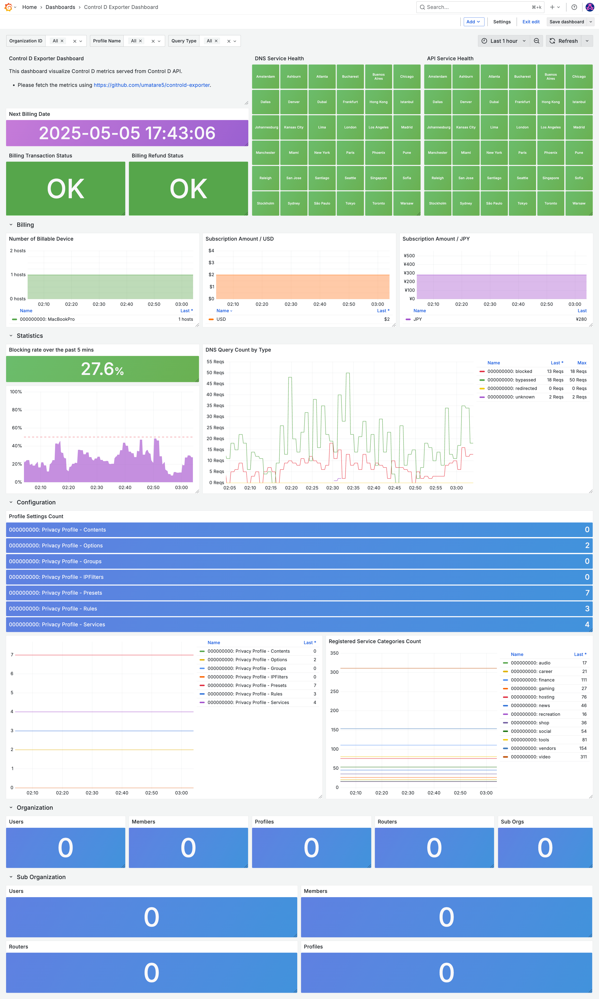

<div align="center">

  

  <h1>controld-exporter</h1>

  <p>A third-party Prometheus Exporter for Control D.</p>

  <p>
    
    <a href="https://github.com/umatare5/controld-exporter/actions/workflows/go-test-build.yml"></a>
    <a href="https://github.com/umatare5/controld-exporter/actions/workflows/go-vulncheck.yml"></a><br>
    <a href="https://pkg.go.dev/github.com/umatare5/controld-exporter@main"></a>
    <a href="./LICENSE"></a>
  </p>

</div>

## Overview

This exporter reads the [Control D](https://controld.com/) API with one account token and publishes the account's state as Prometheus metrics.

- 💚 **Service Health**: Control D's own DNS, API and proxy status, per point of presence
- ⚙️ **Configuration Drift**: Filter, rule and option counts per profile, so an edit is visible as a step
- 💳 **Billing Visibility**: Payment status, refund status and the next billing instant
- 🏢 **Organization Scope**: Members, users, routers and profiles across an organization and its sub-organizations

> [!IMPORTANT]
> The exporter needs a Control D API token, which is issued from the account dashboard. See the [Control D Getting Started guide](https://docs.controld.com/reference/get-started) for how to register and create one.

## Quick Start

### 1. Set the API token

```bash
export CTRLD_API_KEY="your-control-d-api-token"
```

### 2. Run the exporter with Docker

```bash
docker run -p 10034:10034 -e CTRLD_API_KEY ghcr.io/umatare5/controld-exporter
```

### 3. Scrape it

```bash
curl -s http://localhost:10034/metrics | head
```

> [!TIP]
> If you prefer using binaries, download them from the [release page](https://github.com/umatare5/controld-exporter/releases).
>
> **Supported Platforms:** `linux_amd64`, `linux_arm64`, `darwin_amd64`, `darwin_arm64` and `windows_amd64`

## Syntax

`controld-exporter --help` prints every flag, and [`docs/configuration.md`](docs/configuration.md) carries the same list with the defaults and the note each one needs.

| Flag                       | Effect                                             |
| :------------------------- | :------------------------------------------------- |
| `--controld.api-key`       | The Control D token, or `CTRLD_API_KEY`            |
| `--controld.business-mode` | Read the organization instead of the account       |
| `--web.listen-port`        | The port the HTTP server binds, `10034` by default |
| `--log.level`              | `debug` adds the request URI and the decoded body  |

> [!IMPORTANT]
> The exporter starts in personal mode, where `orgId` reads `000000000` on every series that carries it and the `controld_organization_*` families are absent. `--controld.business-mode` needs a token with organization scope; without one the exporter terminates on the first scrape.

## Endpoints

| Path       | Serves                                         |
| :--------- | :--------------------------------------------- |
| `/`        | A landing page linking the telemetry path      |
| `/metrics` | The Control D series, rebuilt on every request |

Nothing is cached between requests, so a scrape costs one Control D API call per collector and its latency is the API's. See [`docs/README.md`](docs/README.md) for the scrape path and the timeouts around it.

## Metrics

Every series is namespaced `controld_` and grouped by the collector that reads it. See [`docs/collectors.md`](docs/collectors.md) for the full catalogue, the labels and the per-family caveats.

| Collector      | Publishes                                          |
| :------------- | :------------------------------------------------- |
| `billing`      | Payment status, amount and next billing instant    |
| `endpoint`     | Clients counted against each device                |
| `network`      | Control D service status per point of presence     |
| `profile`      | Filter, rule, group and option counts per profile  |
| `service`      | Services in each category                          |
| `stats`        | DNS queries by verdict, over the last minute       |
| `organization` | Organization and sub-organization inventory counts |

> [!NOTE]
> No series describes the exporter itself, and a scrape whose every collector failed still answers 200 with an empty body. Alert on the absence of a series the account always has — [`examples/prometheus_alert_rules.yml`](examples/prometheus_alert_rules.yml) does that with `absent()`.

## Use Cases

### Prometheus Configuration

1. Add the job config to your Prometheus YAML file using [`examples/prometheus.yml`](examples/prometheus.yml) as a reference.
2. Set up alerting rules using [`examples/prometheus_alert_rules.yml`](examples/prometheus_alert_rules.yml) as a reference.

The scrape job sets `scrape_interval: 60s` and `scrape_timeout: 50s` because each scrape waits on the Control D API rather than on a cached snapshot.

### Grafana Dashboard

A sample dashboard schema is available at [`examples/control-d-exporter-dashboard.json`](examples/control-d-exporter-dashboard.json).



## Contributing

See [`CONTRIBUTING.md`](CONTRIBUTING.md) for the make targets, the build and the release procedure.

## Acknowledgement

I launched this project with the help of **GitHub Copilot Coding Assistant**, and I am grateful to the global developer community for their contributions to open source projects and public repositories.

## Licence

[MIT](LICENSE)

## Author

[umatare5](https://github.com/umatare5)
