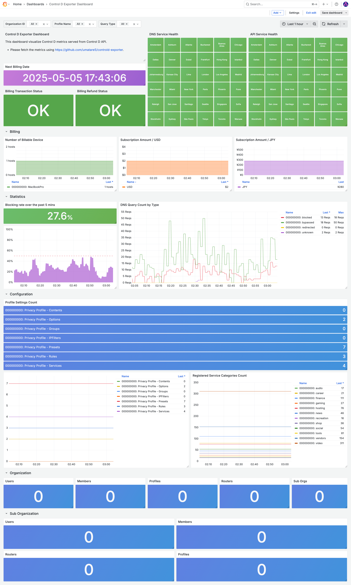

# controld-exporter


[](https://pkg.go.dev/github.com/umatare5/controld-exporter)
[](https://goreportcard.com/report/github.com/umatare5/controld-exporter)
[](https://github.com/umatare5/controld-exporter/blob/main/LICENSE)

controld-exporter is a third-party Prometheus Exporter for Control D.

- 💚 Enables health checks for DNS, API, and proxy services  
- ⚙️ Tracks changes in predefined and custom settings with trend visualization  
- 📈 Provides short-term monitoring and long-term observability of costs, endpoints, and other statistics

> [!Important]
>
> To access the Control D API, you must register with Control D and generate an access token.
> - Please refer to the [Control D - The official Getting Started Guide](https://docs.controld.com/reference/get-started)

## Quick Start

```bash
docker run -p 10034:10034 -e CTRLD_API_KEY ghcr.io/umatare5/controld-exporter
```

- `-p`: Publish a container's port `10034/tcp`, to the host `10034/tcp`.
- `-e`: Forward environment variable `CTRLD_API_KEY` into a container.

> [!Tip]
> If you prefer using binaries, download them from the [release page](https://github.com/umatare5/controld-exporter/releases).
>
> - Supported Platforms: `linux_amd64`, `linux_arm64`, `darwin_amd64`, `darwin_arm64` and `windows_amd64`

## Syntax

```bash
NAME:
   controld-exporter - A Prometheus exporter for metrics from the Control D

USAGE:
   controld-exporter [options...]

VERSION:
   v1.0.0

GLOBAL OPTIONS:
   --web.listen-address string             Address to bind the HTTP server to. (default: "0.0.0.0")
   --web.listen-port int                   Port number to bind the HTTP server to. (default: 10034)
   --web.telemetry-path string, -p string  Path for the metrics endpoint. (default: "/metrics")
   --controld.api-key string, -k string    API key for authenticating with the Control D API. [$CTRLD_API_KEY]
   --controld.business-mode                Enable the metrics collection available in the business subscription. (default: false)
   --log.level string                      Set the logging level. One of: [debug, info, warn, error] (default: "info")
   --help, -h                              show help
   --version, -v                           print the version
```

> [!Tip]
> By default, the controld-exporter starts in personal mode. In this mode, the label `orgId` for each metric will be filled with `000000000`.
> If you have the business subscription, please enable `--controld.business-mode`. This flag allows the retrieval of organization-related metrics.

## Configuration

This exporter supports following environment variables:

| Environment Variable | Description                          |
| :------------------- | ------------------------------------ |
| `CTRLD_API_KEY`      | The API Key to be used for requests. |

## Metrics

This exporter returns following metrics:

| Metric Name                                        | Description                                                               | Type    | Example      |
| -------------------------------------------------- | ------------------------------------------------------------------------- | ------- | ------------ |
| `controld_billing_status`                          | Billing status of the account.                                            | Gauge   | `0` or `1`   |
| `controld_billing_refunded_status`                 | Refunded status of the account.                                           | Gauge   | `0` or `1`   |
| `controld_billing_subscription_amount_total`       | Amount of billing subscription in the specified currency.                 | Gauge   | `2`          |
| `controld_billing_subscription_nextbill_timestamp` | Unix time of the next billing date for a subscription.                    | Gauge   | `1744464600` |
| `controld_endpoint_clients_total`                  | Number of clients for each endpoint.                                      | Gauge   | `1`          |
| `controld_network_health_code`                     | Health status of the network by city and service type.                    | Gauge   | `-1`         |
| `controld_profile_content_filters_total`           | Number of content filters in a profile.                                   | Gauge   | `1`          |
| `controld_profile_enabled_option_total`            | Number of enabled options in a profile.                                   | Gauge   | `1`          |
| `controld_profile_groups_total`                    | Number of group filters in a profile.                                     | Gauge   | `1`          |
| `controld_profile_ip_filters_total`                | Number of IP filters in a profile.                                        | Gauge   | `1`          |
| `controld_profile_preset_filters_total`            | Number of preset filters in a profile.                                    | Gauge   | `1`          |
| `controld_profile_rules_total`                     | Number of rule filters in a profile.                                      | Gauge   | `1`          |
| `controld_profile_services_total`                  | Number of service filters in a profile.                                   | Gauge   | `1`          |
| `controld_service_categories_total`                | Number of service categories for each endpoint.                           | Gauge   | `1`          |
| `controld_stats_last_queries_count`                | [Experimental] Count of DNS queries by type (redirect, success, blocked). | Counter | `1`          |
| `controld_organization_members_total`              | [Business] Number of members in an organization.                          | Gauge   | `1`          |
| `controld_organization_profiles_total`             | [Business] Number of profiles in an organization.                         | Gauge   | `1`          |
| `controld_organization_routers_total`              | [Business] Number of routers in an organization.                          | Gauge   | `1`          |
| `controld_organization_sub_orgs_total`             | [Business] Number of sub-organizations in an organization.                | Gauge   | `1`          |
| `controld_organization_users_total`                | [Business] Number of users in an organization.                            | Gauge   | `1`          |
| `controld_sub_organization_members_total`          | [Business] Number of members in a sub-organization.                       | Gauge   | `1`          |
| `controld_sub_organization_profiles_total`         | [Business] Number of profiles in a sub-organization.                      | Gauge   | `1`          |
| `controld_sub_organization_routers_total`          | [Business] Number of routers in a sub-organization.                       | Gauge   | `1`          |
| `controld_sub_organization_users_total`            | [Business] Number of users in a sub-organization.                         | Gauge   | `1`          |

## Usage

### Exporter

Visit http://localhost:10034/ to verify the exporter is running.

#### Using Docker

```bash
$ CTRLD_API_KEY="foobarbaz"
$ docker run -p 10034:10034 -e CTRLD_API_KEY ghcr.io/umatare5/controld-exporter
time="2025-04-13T18:50:54Z" level=info msg="Starting the personal mode exporter on port 10034."
```

#### Using Binary

```bash
$ CTRLD_API_KEY="foobarbaz"
$ ./controld-exporter
time="2025-04-13T18:50:54Z" level=info msg="Starting the personal mode exporter on port 10034."
```

### Prometheus Configuration

This section describes how to configure Prometheus to scrape metrics from the controld-exporter.

1. Add the job config to your Prometheus YAML file using [examples/prometheus.yml](./examples/prometheus.yml) as a reference.
2. Set up alerting rules using [examples/prometheus.alert_rules.yml](./examples/prometheus.alert_rules.yml) as a reference.

### Grafana Dashboard

A sample dashboard schema is available at [examples/control-d-exporter-dashboard.json](./examples/control-d-exporter-dashboard.json).



## Development

### Build

The repository includes a ready to use `Dockerfile`. To build a new Docker image:

```bash
make image
```

This creates an image named `$USER/controld-exporter` and exposes `10034/tcp`.

### Release

To release a new version, follow these steps:

1. Update the version in the `VERSION` file.
2. Submit a pull request with the updated `VERSION` file.

Once the pull request is merged, the GitHub Workflow will automatically:

- Create and push a new tag based on the `VERSION` file.

After that, I will manually release using [GitHub Actions: release workflow](https://github.com/umatare5/controld-exporter/actions/workflows/release.yaml).

## Acknowledgement

This application was developed with the assistance of GitHub Copilot. Many thanks to all the developers whose code, documentation, and ideas made that assistance possible.

## Licence

[MIT](LICENSE)

## Author

[umatare5](https://github.com/umatare5)
