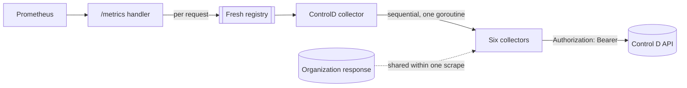

# Architecture

This document preserves the foundational design and architectural principles of the controld-exporter.

## Scrape Path

Every scrape reads Control D directly rather than a cached snapshot, ensuring metric latency reflects the API's own response times. The handler constructs a [fresh registry and collector chain per request](../internal/server/server.go#L72), meaning no internal state survives between scrapes. The [six core collectors](../internal/collector/main.go#L232) share a single goroutine, executing sequentially, which means a slow API call will linearly delay the entire scrape duration.

The API cost scales inherently with the account tier. The upstream API client imposes no hard timeouts or automatic retries on these calls, and overlap is not prevented; concurrent scrapes will open parallel request streams against the same API key.

| Mode                       | Requests per scrape | Scaling term                |
| :------------------------- | :------------------ | :-------------------------- |
| Personal, the default      | 6                   | Fixed                       |
| `--controld.business-mode` | 8                   | Plus 3 per sub-organization |

Because the Control D API responses carry no `X-RateLimit-*` or `Retry-After` headers, the Prometheus scrape interval acts as the sole pacing mechanism. The reference configuration in [`examples/prometheus.yml`](../examples/prometheus.yml) specifies a 60-second interval with a 50-second timeout. The exporter server enforces a [one-minute write timeout](../internal/server/server.go#L63) that fails the Prometheus response, but this does not explicitly cancel the backend HTTP requests.

Keeping `scrape_timeout` strictly below this threshold ensures Prometheus abandons the hung connection first and accurately records a scrape failure.

## Endpoints

Both paths answer on the address `--web.listen-address` and `--web.listen-port` bind, and neither authenticates. The network exposure is entirely up to the operator; [`SECURITY.md`](../SECURITY.md) specifies the operational security and egress patterns for these endpoints.

| Path       | Methods | Status   | Behavior                                       |
| :--------- | :------ | :------- | :--------------------------------------------- |
| `/metrics` | Any     | 200, 500 | The metrics endpoint; configurable by the flag |
| `/`        | Any     | 200      | Catch-all landing page, never 404              |

The exporter runs a unified HTTP multiplexer. Every path that no handler explicitly claims falls through to the [`/` landing page](../internal/server/server.go#L47), returning an HTTP 200 with an HTML payload rather than a 404 Not Found. A probe asserting on status alone therefore cannot distinguish a mistyped telemetry path from a healthy one, and the landing page itself prints the configured path.

When the telemetry path is shifted via `--web.telemetry-path`, the old path immediately reverts to serving the catch-all landing page. The `/metrics` route answers 500 only when the gather itself returns an error and no family survived it. A collector that fails cleanly returns no error, so a scrape whose collectors all failed still serializes an HTTP 200 with an empty body and leaves `up` at 1.

## Absence

A Control D call that fails strictly withholds the resulting series rather than fabricating a `0` or repeating a stale value. This failure is inherently scoped to the individual call; a non-2xx HTTP status, a malformed JSON payload, or a `"success": false` envelope withholds only the specific series derived from that response. Consequently, a collector can gracefully fail in parts.

For example, billing reads payments and subscriptions independently, and a single sub-organization network error skips only its own series while allowing the rest to publish seamlessly. No metrics encode collector failures; operators must rely on the application log for diagnostic tracing.

An empty upstream state translates to complete metrics absence. An account with zero configured payments, devices, or profiles will publish zero related series. The API signals an empty collection via HTTP 404 and [error code `40401`](../internal/controld/helper.go#L86), which the internal client deliberately intercepts as a valid empty state rather than a failure.

Control D restates the HTTP status in the first three digits of its own error code, so the code carries a reason the status omits. A `400` with `40001` reports a missing or invalid token, a `403` with `40301` reports a token without access to that endpoint, and the `404` with `40401` above reports an empty collection rather than a fault.

Query reporting is unreachable by design rather than unimplemented. The `/v2/statistic/timeseries/action` route on `analytics.controld.com` answers `401` to an API key the main host accepts, admitting only the browser session token the dashboard signs in with. No credential this exporter can hold reads it, so no query series exists at all.

Conversely, if a previously populated field disappears from the API payload, it implicitly decodes and publishes as `0`, because only transport or envelope-level errors trigger structural absence. Prometheus ultimately manages these transitions via staleness markers, presenting dashboard gaps instead of misleading flat lines when a series drops out of a scrape.

Token validity heavily influences absence patterns. The `/network` and `/services/categories` endpoints are unauthenticated upstream. Their corresponding metrics will continue to publish even if the API key is revoked, meaning the scrape still succeeds with HTTP 200.

The `ControlDMetricsMissing` rule in [`examples/prometheus_alert_rules.yml`](../examples/prometheus_alert_rules.yml) cross-references a token-gated family against a token-free one to catch this specific revocation state. Finally, a failed `/organizations/organization` call broadly impacts business mode, inherently withholding endpoint, profile, and service collectors that depend on it. This yields an HTTP 200 carrying only billing and network metrics.

## Metric Types

Every series published by this exporter is strictly typed as a gauge. These metrics unconditionally restate an absolute configuration count or a static status code in full, rather than accumulating over time. Because no series operates as a monotonic counter, PromQL functions like `rate()` and `increase()` are invalid against this dataset and will yield no meaningful output.

Despite the prevailing OpenMetrics convention that reserves the `_total` suffix for monotonic counters, nineteen of these gauge families retain that suffix. This naming scheme is historically entrenched and strictly tracks the upstream Control D entity counts, such as total configured filters or members.

## Account Scope

The `--controld.business-mode` flag strictly determines the API traversal scope, and the resulting `orgId` metric label immutably records that configuration across every applicable series.

| Mode                       | Reads                             | `orgId` holds                                     |
| :------------------------- | :-------------------------------- | :------------------------------------------------ |
| Personal, the default      | The account the key belongs to    | [`000000000`](../internal/collector/helper.go#L9) |
| `--controld.business-mode` | The organization and each sub-org | The org's or sub-org's key                        |

Business mode iterates each sub-organization by re-issuing the identical endpoint requests under an explicit [`X-Force-Org-Id` header](../internal/controld/helper.go#L27). This architecture means the overall API request volume directly scales linearly with the number of configured sub-organizations. The execution of these scoped requests mandates an API key endowed with organizational privileges.

This key is strictly confined to the [outbound `Authorization` header](../internal/controld/helper.go#L66) and is deliberately absent from any exported metric labels or process state exposure.

## Dashboards

The [`examples/control-d-exporter-dashboard.json`](../examples/control-d-exporter-dashboard.json) file provides a unified Grafana schema designed to accommodate both personal and business operational modes. The dashboard's interactive `$orgID` and `$profileName` variables dynamically populate directly from the underlying Prometheus label space. Consequently, a deployment running strictly in personal mode will offer `000000000` as its singular organizational variable option.

The dashboard implementations deliberately hard-code the currency metrics for baseline visualization. The default billing panels explicitly query and render `USD` and `JPY` denominations. Environments that settle upstream invoices in alternative currencies must manually update the underlying PromQL expressions within these panels to match their corresponding ISO codes.
